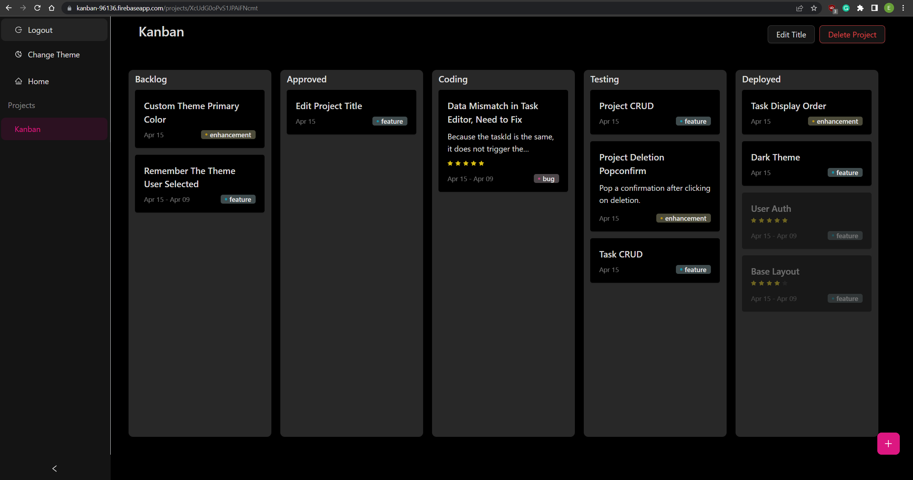

<p align="center">
  
</p>

A kanban website built with NextJS + Ant Design, a tool for visualizing and controlling the project development process for software development engineers. After logging in with a Google account verified by Firebase, users can create and edit multiple projects. Within each project, users can create and edit multiple tasks, set details, priorities, deadlines, etc., and use drag and drop to set the current development stage. You can choose light or dark themes according to your needs.

## Features

- Drag and drop
- Optimized for desktop devices
- Dark theme
- Ant Design
- Typescript / React / Redux / Nextjs
- Firebase: auth / firestore

## Getting Started

First fill env variables for `firebaseConfig`.

`.env.local`

```
NEXT_PUBLIC_FIREBASE_PUBLIC_API_KEY=
NEXT_PUBLIC_FIREBASE_AUTH_DOMAIN=
NEXT_PUBLIC_FIREBASE_PROJECT_ID=
NEXT_PUBLIC_FIREBASE_STORAGE_BUCKET=
NEXT_PUBLIC_FIREBASE_MESSAGING_SENDER_ID=
NEXT_PUBLIC_FIREBASE_APP_ID=
NEXT_PUBLIC_FIREBASE_MEASUREMENT_ID=
```

Run the development server:

```bash
npm run dev
# or
yarn dev
# or
pnpm dev
```

Open [http://localhost:3000](http://localhost:3000) with your browser to see the result.

### Cloud Firestore Rules

```CEL
rules_version = '2';
service cloud.firestore {
  match /databases/{database}/documents {
    match /users/{userId}/{other=**} {
      allow read, write: if
          request.auth != null && request.auth.uid == userId;
    }
  }
}
```

## My Notes

1. [firebase prebuilt ui with nextjs](https://dev.to/menard_codes/next-js-sign-in-page-with-firebase-ui-and-firebase-auth-5375) - conflict with tailwindcss
2. [tailwindcss preflight causes buttons transparent](https://stackoverflow.com/questions/71783177/remove-specific-style-from-tailwind-base)
3. [for of Array.prototype.entries() get a ts error](https://stackoverflow.com/questions/73099543/type-setunknown-can-only-be-iterated-through-when-using-the-downleveliter)
4. [a react beautiful dnd issue caused by react strict mode](https://github.com/atlassian/react-beautiful-dnd/issues/2396)
